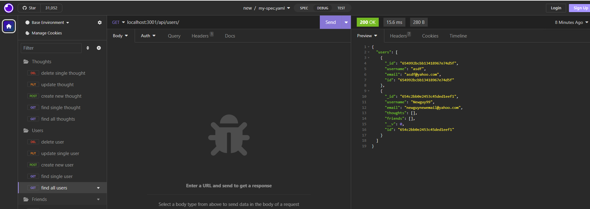

# Social-network-api

## Description
User will be able to start the application with the command - npm run start. User then will be able to either insomnia or postman and test the routes. When user enters the proper endpoint and http method, they will be able to find all, find a single, create one, and delete one thought and/or user. 

## Contributors
George - TA
Kirtley - TA

## Screenshots

## Links
Video - https://drive.google.com/file/d/15PDsUV7Xy0GI8_lXXOXoH3GF3qcVO9ns/view
Github - https://github.com/Ali-Aldawoodi/Social-network-api